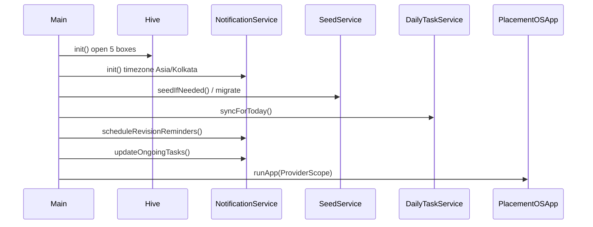

# Project Architecture

This document describes how **Lekhraj** is structured in code. It reflects the implementation as of **v2.0.0+1**—not aspirational design.

## Overview

Lekhraj is a **Flutter Android app** organized in three primary layers plus shared core utilities:

```
┌─────────────────────────────────────────────────────────────┐
│                    presentation/                            │
│   Screens · Riverpod providers · Shared widgets             │
└───────────────────────────┬─────────────────────────────────┘
                            │
┌───────────────────────────▼─────────────────────────────────┐
│                      domain/                                │
│   Entities · Business services (revision, tasks, PDF)      │
└───────────────────────────┬─────────────────────────────────┘
                            │
┌───────────────────────────▼─────────────────────────────────┐
│                       data/                                 │
│   HiveService · Repositories · Asset seeding                │
└───────────────────────────┬─────────────────────────────────┘
                            │
┌───────────────────────────▼─────────────────────────────────┐
│                    Hive (on-device)                         │
│   problems · tasks · settings · revision_history · short_notes│
└─────────────────────────────────────────────────────────────┘
```

**Package name:** `placement_os`  
**Product name:** Lekhraj  
**Version:** 2.0.0+1

---

## Directory map

| Path | Role |
|------|------|
| `lib/main.dart` | App entry: Hive init, notifications, seed, daily sync, `runApp` |
| `lib/app.dart` | `MaterialApp.router`, waits on `seedProvider` |
| `lib/core/constants/` | Colors, routes, Hive box names, branding |
| `lib/core/router/` | `GoRouter` + shell routes |
| `lib/core/theme/` | Material 3 dark theme |
| `lib/core/services/` | `NotificationService` |
| `lib/data/datasources/` | `HiveService`, `RoadmapDataSource` |
| `lib/data/repositories/` | Seed, Problem, Task, Settings, ShortNotes repos |
| `lib/domain/entities/` | All models and enums |
| `lib/domain/services/` | Revision, daily tasks, PDF export |
| `lib/domain/constants/` | Note markdown template |
| `lib/presentation/providers/` | Riverpod providers + `refresh()` helper |
| `lib/presentation/screens/` | Feature screens |
| `lib/presentation/widgets/` | Reusable UI components |
| `assets/data/striver_a2z.json` | Canonical 474-problem sheet |
| `tool/enrich_patterns.py` | Dev-only JSON pattern enrichment |

---

## Startup sequence



Each step is wrapped in try/catch in `main.dart` so partial failures do not crash the app.

---

## Routing

**Shell routes** (bottom navigation via `MainShell`):

| Index | Route | Screen |
|-------|-------|--------|
| 0 | `/` | `HomeScreen` |
| 1 | `/dsa` | `DsaSheetScreen` |
| 2 | `/revision` | `RevisionScreen` |
| 3 | `/dry-run` | `DryRunScreen` |
| 4 | `/notes` | `NotesScreen` |
| 5 | `/settings` | `SettingsScreen` |

**Full-screen routes:**

| Route | Screen |
|-------|--------|
| `/problem/:id` | `ProblemDetailScreen` |
| `/search` | `SearchScreen` |
| `/patterns` | `PatternsScreen` |
| `/patterns/:name` | `PatternDetailScreen` |

Implementation: `lib/core/router/app_router.dart`, `lib/presentation/screens/main_shell.dart`

---

## State management

**Riverpod** providers in `lib/presentation/providers/providers.dart`:

| Provider | Purpose |
|----------|---------|
| `seedProvider` | Async initial seed/migration |
| `problemRepoProvider` | Problem CRUD, search, patterns |
| `taskRepoProvider` | Daily and user tasks |
| `settingsRepoProvider` | App settings, streak |
| `shortNotesRepoProvider` | Yaad Rakhna notes |
| `smartRevisionProvider` | Sequential revision queue |
| `starRevisionProvider` | Star revision batch |
| `dailyNewQuestionsProvider` | Unsolved daily batch |
| `dailyTaskServiceProvider` | Orchestrates all daily tasks |
| `todayTasksStateProvider` | Home screen task state |
| `refreshProvider` | Manual invalidation counter |

**Refresh pattern:** Mutations call `refresh(ref)` to increment `refreshProvider`, causing dependent providers to rebuild.

---

## Data layer

### Hive boxes

Defined in `HiveBoxes` (`lib/core/constants/app_constants.dart`), opened in `HiveService.init()`:

| Box | Contents |
|-----|----------|
| `problems` | Topic documents + problem documents (flat key space) |
| `tasks` | User tasks + auto-generated daily tasks |
| `settings` | User settings, seed flags, metadata, deleted-note slot |
| `revision_history` | Per-revision completion records |
| `short_notes` | Standalone short notes |

Storage format: `Box<Map>` with string keys—no Hive code generation.

### Seeding

`SeedService` (`repositories.dart`):

1. On first launch, loads `assets/data/striver_a2z.json` into Hive.
2. On upgrade, runs `_migrateProblems()` and `_syncPatternsFromAsset()` without wiping progress.
3. Seed completion tracked via `settings.seed_v5`.

### Repositories

| Repository | Responsibility |
|------------|----------------|
| `ProblemRepository` | Problems, topics, notes, revision history, search, export/import |
| `TaskRepository` | CRUD for tasks, auto-task cleanup |
| `SettingsRepository` | Settings persistence, streak, activity |
| `ShortNotesRepository` | Short note CRUD |

---

## Domain services

### SmartRevisionService

File: `lib/domain/services/smart_revision_service.dart`

- Builds queue from **solved** problems sorted by sheet `order`.
- Maintains `revisionQueueIndex` in settings.
- Produces `todayBatch` sized by `revisionsPerDay`.
- Optional `activePatternFilter` for pattern-scoped revision.
- Records revision + confidence into history and settings accuracy counters.

### StarRevisionService

File: `lib/domain/services/star_revision_service.dart`

- Operates on **starred** problems in sheet order.
- Separate queue index: `starRevisionQueueIndex`.
- Daily batch size: `dailyStarRevision`.

### DailyNewQuestionsService

File: `lib/domain/services/daily_new_questions_service.dart`

- Picks next **unsolved** problems in sheet order.
- Tracks `todayNewQuestionsCount` per calendar day.

### DailyTaskService

File: `lib/domain/services/daily_task_service.dart`

Central orchestrator for Home screen tasks:

1. **`syncForToday()`** — On new day: reset counters, clear auto tasks, persist today's batches as `TaskEntity` rows.
2. **`getTodayState()`** — Reads Hive auto tasks → `TodayProblemTask` list with completion flags.
3. **`toggleNewQuestion` / `toggleRevision` / `toggleStarRevision`** — Checkbox on/off with undo support.
4. **`_ensureTodayAutoTasks()`** — Restores missing per-type tasks if partial data exists.

### PdfExportService

File: `lib/domain/services/pdf_export_service.dart`

- Exports problems with notes (compact list format).
- Appends short notes under **"Mistakes & Yaad Rakhna"**.
- Shares via `share_plus`.

---

## Key entities

File: `lib/domain/entities/entities.dart`

| Entity | Purpose |
|--------|---------|
| `ProblemEntity` | Sheet problem + solved/starred/notes/revision state |
| `TopicEntity` | Topic grouping |
| `TaskEntity` | Daily user/auto task |
| `TodayProblemTask` | Problem + completion for Home UI |
| `TodayTasksState` | All Home task sections + progress counts |
| `AppSettingsEntity` | Daily limits, queue indices, streak, notifications |
| `RevisionQueueState` | Revision screen queue snapshot |
| `ShortNoteEntity` | Standalone reminder note |
| `PatternStats` | Pattern progress aggregates |

---

## Notifications

`NotificationService` (`lib/core/services/notification_service.dart`):

| Feature | Behavior |
|---------|----------|
| Ongoing notification | Lists incomplete today's tasks; dismisses when all done |
| Morning reminder | Scheduled daily at user-configured time (IST) |
| Evening reminder | Scheduled daily at user-configured time (IST) |
| Workmanager | Initialized with stub callback (no registered background tasks) |

Android permissions: `POST_NOTIFICATIONS`, exact alarm permissions, boot completed.

---

## Asset pipeline

```
striver_a2z.json
       │
       ▼
SeedService ──► Hive (problems box)
       │
       ▼
ProblemRepository.getAllProblems()
       │
       ├──► DSA Sheet / Search / Patterns UI
       ├──► Revision services
       └──► Daily task batching
```

Optional dev step: `python tool/enrich_patterns.py` enriches pattern tags in JSON before rebuild.

---

## Testing

Current tests: `test/revision_engine_test.dart` (modulo arithmetic placeholder).

**Recommended test targets:**

- `SmartRevisionService.getState()` queue wrapping
- `DailyTaskService.syncForToday()` and `_ensureTodayAutoTasks()`
- `ProblemRepository.queryProblems()` filters
- Widget tests for Home task toggles

---

## Known architectural gaps

Documented honestly for contributors and reviewers:

| Gap | Detail |
|-----|--------|
| No cloud layer | Hive only; no sync repository |
| Unused `fl_chart` | Declared in pubspec, not imported in lib |
| Workmanager stub | No background task registration |
| `RevisionConfig.intervalDays` | Constant unused; revision is index-based |
| Single roadmap | `RoadmapDataSource` registers only Striver A2Z |
| Release signing | Debug keystore in release build config |

See [ROADMAP.md](ROADMAP.md) for remediation plans.

---

## Android host

| Setting | Value |
|---------|-------|
| namespace / applicationId | `com.placementos.app` |
| label | Lekhraj |
| minSdk | 24 |

Files: `android/app/build.gradle`, `android/app/src/main/AndroidManifest.xml`
